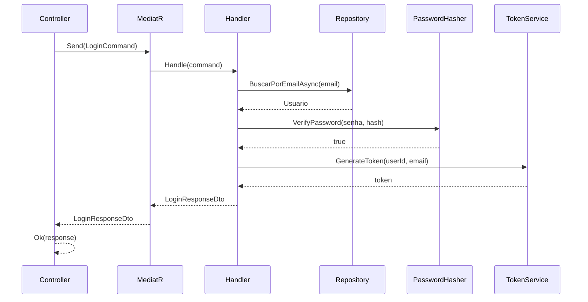

# 🏗️ Arquitetura do SpendWise Auth

## Clean Architecture

O SpendWise Auth segue rigorosamente os princípios da **Clean Architecture**, garantindo separação de responsabilidades e independência de frameworks.

### Diagrama de Camadas

```
┌─────────────────────────────────────────────────────┐
│                  SpendWise.Auth.API                 │
│              (Controllers, Middleware)              │
└────────────────────┬────────────────────────────────┘
                     │
┌────────────────────┴────────────────────────────────┐
│           SpendWise.Auth.Infrastructure             │
│     (Repositories, DbContext, Services)             │
└────────────────────┬────────────────────────────────┘
                     │
┌────────────────────┴────────────────────────────────┐
│           SpendWise.Auth.Application                │
│       (Commands, Handlers, DTOs, Validators)        │
└────────────────────┬────────────────────────────────┘
                     │
┌────────────────────┴────────────────────────────────┐
│             SpendWise.Auth.Domain                   │
│    (Entities, Value Objects, Interfaces)            │
└─────────────────────────────────────────────────────┘
```

### Dependências

```
API → Infrastructure → Application → Domain
                    ↓
                Application → Domain
```

**Regra de Ouro**: As dependências sempre apontam para dentro (em direção ao Domain).

---

## Domain Layer (Camada de Domínio)

### Responsabilidades
- Definir entidades de negócio
- Implementar regras de negócio
- Definir contratos (interfaces)
- Criar Value Objects

### Estrutura

```
SpendWise.Auth.Domain/
├── Entities/
│   └── Usuario.cs
├── ValueObjects/
│   └── Email.cs
├── Interfaces/
│   ├── IPasswordHasher.cs
│   ├── ITokenService.cs
│   ├── IEmailService.cs
│   ├── IUsuarioRepository.cs
│   └── IUnitOfWork.cs
└── BaseEntity.cs
```

### Características
- ✅ Sem dependências externas
- ✅ Lógica de negócio pura
- ✅ Testável isoladamente
- ✅ Agnóstico a frameworks

---

## Application Layer (Camada de Aplicação)

### Responsabilidades
- Orquestrar casos de uso
- Implementar CQRS com MediatR
- Validar entrada de dados
- Transformar dados (DTOs)

### Estrutura

```
SpendWise.Auth.Application/
├── Commands/
│   └── AuthCommands.cs
├── Handlers/
│   ├── LoginHandler.cs
│   ├── RegisterHandler.cs
│   ├── ForgotPasswordHandler.cs
│   ├── ResetPasswordHandler.cs
│   └── ValidateTokenHandler.cs
├── DTOs/
│   └── AuthDtos.cs
└── DependencyInjection.cs
```

### CQRS Pattern

#### Commands
```csharp
public record LoginCommand(
    string Email,
    string Senha
) : IRequest<LoginResponseDto>;
```

#### Handlers
```csharp
public class LoginHandler : IRequestHandler<LoginCommand, LoginResponseDto>
{
    public async Task<LoginResponseDto> Handle(
        LoginCommand request, 
        CancellationToken cancellationToken)
    {
        // 1. Buscar usuário
        // 2. Verificar senha
        // 3. Gerar token
        // 4. Retornar resposta
    }
}
```

---

## Infrastructure Layer (Camada de Infraestrutura)

### Responsabilidades
- Implementar acesso a dados
- Implementar serviços externos
- Configurar Entity Framework
- Gerenciar migrations

### Estrutura

```
SpendWise.Auth.Infrastructure/
├── Data/
│   └── AuthDbContext.cs
├── Repositories/
│   ├── UsuarioRepository.cs
│   └── UnitOfWork.cs
├── Services/
│   ├── PasswordHasher.cs
│   ├── TokenService.cs
│   └── MockEmailService.cs
├── Migrations/
└── DependencyInjection.cs
```

### DbContext

```csharp
public class AuthDbContext : DbContext
{
    public DbSet<Usuario> Usuarios => Set<Usuario>();

    protected override void OnModelCreating(ModelBuilder modelBuilder)
    {
        // Configuração de entidades
        // Mapeamento de Value Objects
        // Índices e constraints
    }
}
```

### Repository Pattern

```csharp
public class UsuarioRepository : IUsuarioRepository
{
    private readonly AuthDbContext _context;

    public async Task<Usuario?> BuscarPorEmailAsync(Email email)
    {
        return await _context.Usuarios
            .FirstOrDefaultAsync(u => u.Email.Valor == email.Valor);
    }
}
```

---

## API Layer (Camada de Apresentação)

### Responsabilidades
- Expor endpoints HTTP
- Autenticar requisições
- Configurar middleware
- Documentar API (Swagger)

### Estrutura

```
SpendWise.Auth.API/
├── Controllers/
│   └── AuthController.cs
├── Properties/
│   └── launchSettings.json
├── Program.cs
└── appsettings.json
```

### Controller

```csharp
[ApiController]
[Route("api/[controller]")]
public class AuthController : ControllerBase
{
    private readonly IMediator _mediator;

    [HttpPost("login")]
    [AllowAnonymous]
    public async Task<ActionResult<LoginResponseDto>> Login(
        [FromBody] LoginRequestDto request)
    {
        var command = new LoginCommand(request.Email, request.Senha);
        var result = await _mediator.Send(command);
        return Ok(result);
    }
}
```

---

## Padrões de Design

### 1. CQRS (Command Query Responsibility Segregation)

**Separação entre leitura e escrita:**

- **Commands**: Operações que modificam estado
- **Queries**: Operações de leitura (futuro)

```csharp
// Command
public record RegisterCommand(...) : IRequest<Guid>;

// Handler
public class RegisterHandler : IRequestHandler<RegisterCommand, Guid>
{
    // Lógica de registro
}
```

### 2. Repository Pattern

**Abstração do acesso a dados:**

```csharp
public interface IUsuarioRepository
{
    Task<Usuario?> BuscarPorIdAsync(Guid id);
    Task<Usuario?> BuscarPorEmailAsync(Email email);
    Task AdicionarAsync(Usuario usuario);
}
```

### 3. Unit of Work

**Gerenciamento de transações:**

```csharp
public interface IUnitOfWork
{
    IUsuarioRepository Usuarios { get; }
    Task<int> SaveChangesAsync();
}
```

### 4. Dependency Injection

**Inversão de controle:**

```csharp
// Infrastructure
services.AddScoped<IUsuarioRepository, UsuarioRepository>();
services.AddScoped<IPasswordHasher, PasswordHasher>();

// Application
services.AddMediatR(cfg => 
    cfg.RegisterServicesFromAssembly(typeof(DependencyInjection).Assembly));
```

### 5. Value Objects

**Encapsulamento de valores:**

```csharp
public class Email
{
    public string Valor { get; private set; }
    
    public Email(string valor)
    {
        // Validação
        if (!EmailRegex.IsMatch(valor))
            throw new ArgumentException("Email inválido");
            
        Valor = valor.ToLowerInvariant();
    }
}
```

---

## Fluxo de uma Requisição

### Exemplo: Login

```
1. HTTP Request
   ↓
2. AuthController.Login()
   ↓
3. LoginCommand criado
   ↓
4. MediatR despacha para LoginHandler
   ↓
5. Handler busca usuário (Repository)
   ↓
6. Handler verifica senha (PasswordHasher)
   ↓
7. Handler gera token (TokenService)
   ↓
8. Handler retorna LoginResponseDto
   ↓
9. Controller retorna HTTP 200 OK
```

### Diagrama de Sequência



---

## Princípios SOLID

### Single Responsibility Principle (SRP)
- Cada classe tem uma única responsabilidade
- `LoginHandler` apenas processa login
- `PasswordHasher` apenas faz hash de senhas

### Open/Closed Principle (OCP)
- Aberto para extensão, fechado para modificação
- Novos handlers podem ser adicionados sem modificar existentes

### Liskov Substitution Principle (LSP)
- Implementações podem ser substituídas por suas interfaces
- `IPasswordHasher` pode ter múltiplas implementações

### Interface Segregation Principle (ISP)
- Interfaces específicas e coesas
- `ITokenService` separado de `IPasswordHasher`

### Dependency Inversion Principle (DIP)
- Dependências apontam para abstrações
- Handlers dependem de `IUsuarioRepository`, não de `UsuarioRepository`

---

## Benefícios da Arquitetura

### Testabilidade
- Cada camada pode ser testada isoladamente
- Mocks fáceis de criar (interfaces)
- Testes unitários rápidos

### Manutenibilidade
- Código organizado e previsível
- Fácil localizar funcionalidades
- Mudanças isoladas

### Escalabilidade
- Camadas podem ser escaladas independentemente
- Fácil adicionar novos casos de uso
- Preparado para microserviços

### Independência de Frameworks
- Domain não conhece EF Core
- Fácil trocar de ORM
- Fácil trocar de banco de dados

---

## Comparação com Arquitetura Monolítica

| Aspecto | Monolítica | Clean Architecture |
|---------|------------|-------------------|
| **Organização** | Por tipo técnico | Por domínio |
| **Dependências** | Acopladas | Invertidas |
| **Testabilidade** | Difícil | Fácil |
| **Manutenção** | Complexa | Simples |
| **Escalabilidade** | Limitada | Flexível |

---

## Próximos Passos

- [ ] Implementar Query side do CQRS
- [ ] Adicionar Event Sourcing
- [ ] Implementar Domain Events
- [ ] Adicionar cache distribuído
- [ ] Implementar API Gateway
