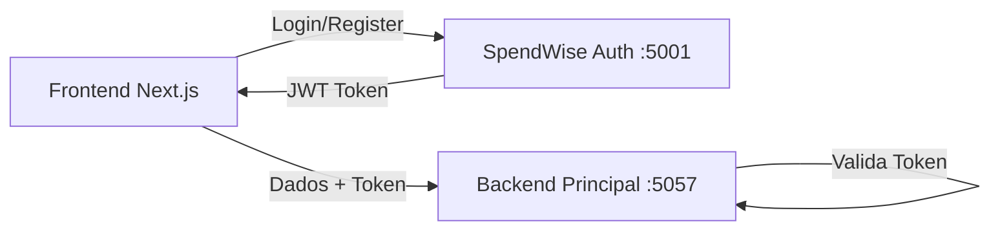

# 🔗 Integração Frontend - SpendWise Auth

## 🎯 Arquitetura

O frontend Next.js se comunica com **dois serviços independentes**:

1. **SpendWise Auth** (porta 5001) - Autenticação
2. **Backend Principal** (porta 5057) - Dados de negócio



---

## 📝 Configuração

### Variáveis de Ambiente

**Arquivo**: `.env.local`

```env
# Autenticação
NEXT_PUBLIC_AUTH_API_URL=http://localhost:5001/api

# Dados de Negócio
NEXT_PUBLIC_API_URL=http://localhost:5057/api
```

---

## 🔄 Fluxo de Autenticação

### 1. Login

```typescript
// Frontend chama Auth Service DIRETO
const response = await fetch('http://localhost:5001/api/auth/login', {
  method: 'POST',
  headers: { 'Content-Type': 'application/json' },
  body: JSON.stringify({ email, senha })
});

const { token, user } = await response.json();
localStorage.setItem('token', token);
```

### 2. Acessar Dados Protegidos

```typescript
// Frontend usa token para acessar Backend Principal
const response = await fetch('http://localhost:5057/api/categorias', {
  headers: {
    'Authorization': `Bearer ${token}`,
    'Content-Type': 'application/json'
  }
});

const categorias = await response.json();
```

---

## 📚 Endpoints

### Auth Service (porta 5001)

| Método | Endpoint | Descrição |
|--------|----------|-----------|
| `POST` | `/api/auth/login` | Login |
| `POST` | `/api/auth/register` | Registro |
| `POST` | `/api/auth/forgot-password` | Solicitar reset |
| `POST` | `/api/auth/reset-password` | Redefinir senha |
| `POST` | `/api/auth/validate` | Validar token |

### Backend Principal (porta 5057)

| Método | Endpoint | Descrição | Auth |
|--------|----------|-----------|------|
| `GET` | `/api/categorias` | Listar categorias | ✅ |
| `GET` | `/api/transacoes` | Listar transações | ✅ |
| `GET` | `/api/relatorios` | Relatórios | ✅ |
| `GET` | `/api/usuarios/me` | Perfil do usuário | ✅ |

---

## ✅ Implementação Completa

Consulte o arquivo [INTEGRACAO_FRONTEND.md](https://github.com/SpendWise-GestaoFinanceira/SpendWise-Auth/blob/main/INTEGRACAO_FRONTEND.md) no repositório do SpendWise Auth para exemplos completos de código.

---

## 🧪 Teste

### 1. Testar Auth Service

```bash
curl -X POST http://localhost:5001/api/auth/login \
  -H "Content-Type: application/json" \
  -d '{"email":"teste@exemplo.com","senha":"senha123"}'
```

### 2. Testar Backend Principal

```bash
curl -X GET http://localhost:5057/api/categorias \
  -H "Authorization: Bearer SEU_TOKEN_AQUI"
```

---

## 🎯 Benefícios

- ✅ **Separação de Responsabilidades**: Auth isolado
- ✅ **Escalabilidade**: Serviços independentes
- ✅ **Segurança**: Tokens validados, não gerados no backend principal
- ✅ **Manutenibilidade**: Código mais organizado
