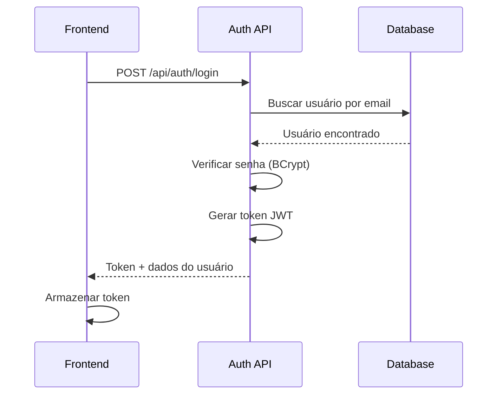
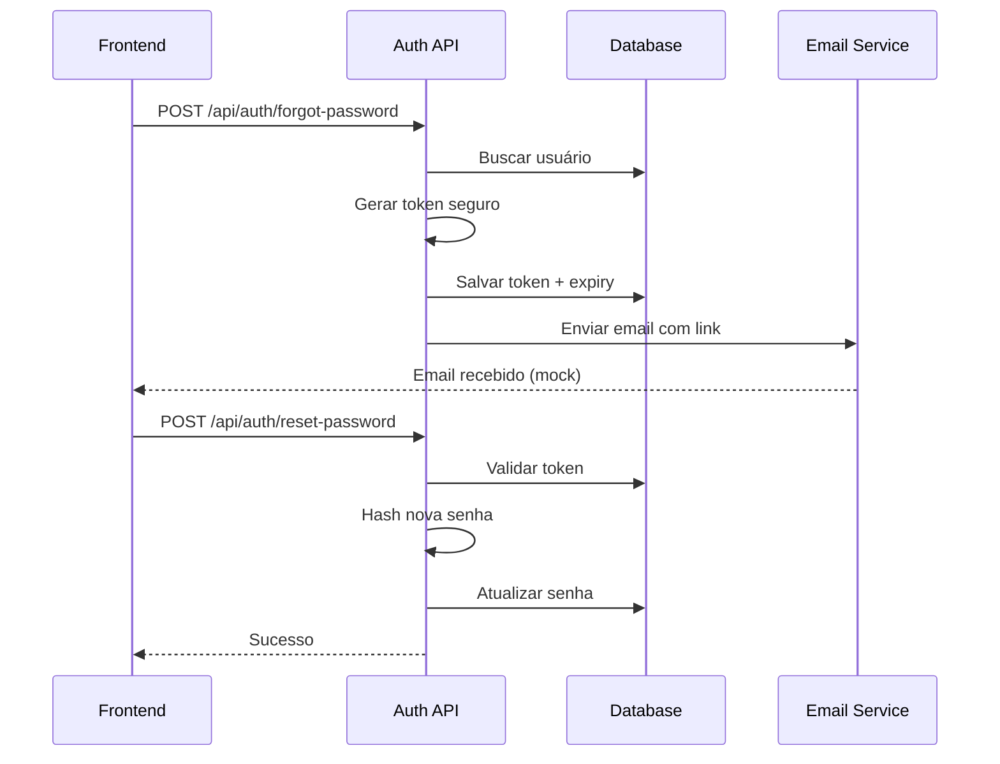

# 🔐 SpendWise Auth

Microserviço independente de autenticação e gerenciamento de usuários do SpendWise.

## 📋 Visão Geral

O **SpendWise Auth** é um serviço dedicado exclusivamente à autenticação, desenvolvido com **ASP.NET Core 9.0** seguindo os princípios de **Clean Architecture**, **CQRS**, **Rich Domain** e **Value Objects**.

### Motivação

A separação do serviço de autenticação do backend principal oferece:

- ✅ **Separação de Responsabilidades**: Cada serviço tem uma única responsabilidade
- ✅ **Escalabilidade Independente**: Escalar autenticação sem afetar outros serviços
- ✅ **Manutenção Facilitada**: Código mais organizado e fácil de manter
- ✅ **Reutilização**: Pode ser usado por outros projetos
- ✅ **Segurança**: Isolamento de dados sensíveis

---

## 🏗️ Arquitetura

O projeto segue **Clean Architecture** com 4 camadas bem definidas:

```
SpendWise-Auth/
├── SpendWise.Auth.Domain/          # Entidades, Value Objects, Interfaces
├── SpendWise.Auth.Application/     # Use Cases, Commands, Handlers, DTOs
├── SpendWise.Auth.Infrastructure/  # Repositórios, DbContext, Serviços
└── SpendWise.Auth.API/             # Controllers, Program.cs, Configurações
```

### Camadas

#### 1. Domain (Domínio)
Contém a lógica de negócio pura, sem dependências externas:

- **Entidades**: `Usuario`
- **Value Objects**: `Email`
- **Interfaces**: Contratos para serviços e repositórios

#### 2. Application (Aplicação)
Implementa os casos de uso do sistema:

- **Commands**: `LoginCommand`, `RegisterCommand`, `ForgotPasswordCommand`, etc.
- **Handlers**: Processam os commands usando MediatR
- **DTOs**: Objetos de transferência de dados

#### 3. Infrastructure (Infraestrutura)
Implementações concretas de serviços e acesso a dados:

- **DbContext**: Entity Framework Core
- **Repositories**: Acesso ao banco de dados
- **Services**: TokenService, PasswordHasher, EmailService

#### 4. API (Apresentação)
Camada de entrada HTTP:

- **Controllers**: Endpoints REST
- **Middleware**: Autenticação, CORS, Logging
- **Configuração**: JWT, Swagger, Serilog

---

## 🛠️ Tecnologias

### Core
- **.NET 9.0**
- **ASP.NET Core Web API**
- **C# 12**

### Persistência
- **Entity Framework Core 9.0.10**
- **PostgreSQL** (Npgsql)

### Padrões e Bibliotecas
- **MediatR 13.1.0** - CQRS
- **FluentValidation 12.1.0** - Validações
- **BCrypt.Net-Next 4.0.3** - Hash de senhas
- **System.IdentityModel.Tokens.Jwt 8.14.0** - JWT

### Observabilidade
- **Serilog 9.0.0** - Logging estruturado
- **Swashbuckle 9.0.6** - Documentação Swagger

---

## 🔌 Endpoints

### Autenticação

| Método | Endpoint | Descrição | Autenticação |
|--------|----------|-----------|--------------|
| `POST` | `/api/auth/login` | Realiza login | ❌ |
| `POST` | `/api/auth/register` | Registra novo usuário | ❌ |
| `GET` | `/api/auth/me` | Dados do usuário autenticado | ✅ |
| `POST` | `/api/auth/forgot-password` | Solicita reset de senha | ❌ |
| `POST` | `/api/auth/reset-password` | Redefine senha com token | ❌ |
| `POST` | `/api/auth/validate` | Valida token JWT | ❌ |

### Exemplos de Uso

#### Login
```bash
POST /api/auth/login
Content-Type: application/json

{
  "email": "usuario@exemplo.com",
  "senha": "senha123"
}
```

**Resposta:**
```json
{
  "token": "eyJhbGciOiJIUzI1NiIsInR5cCI6IkpXVCJ9...",
  "user": {
    "id": "3fa85f64-5717-4562-b3fc-2c963f66afa6",
    "nome": "João Silva",
    "email": "usuario@exemplo.com"
  },
  "expiresAt": "2025-11-04T01:00:00Z"
}
```

#### Registro
```bash
POST /api/auth/register
Content-Type: application/json

{
  "nome": "João Silva",
  "email": "joao@exemplo.com",
  "senha": "senha123",
  "confirmarSenha": "senha123"
}
```

#### Validar Token
```bash
POST /api/auth/validate
Content-Type: application/json

{
  "token": "eyJhbGciOiJIUzI1NiIsInR5cCI6IkpXVCJ9..."
}
```

**Resposta:**
```json
{
  "isValid": true,
  "userId": "3fa85f64-5717-4562-b3fc-2c963f66afa6",
  "email": "usuario@exemplo.com"
}
```

---

## 🗄️ Modelo de Dados

### Entidade Usuario

```csharp
public class Usuario : BaseEntity
{
    public string Nome { get; private set; }
    public Email Email { get; private set; }
    public string Senha { get; private set; }
    public bool IsAtivo { get; private set; }
    
    // Reset de senha
    public string? PasswordResetToken { get; private set; }
    public DateTime? PasswordResetTokenExpiry { get; private set; }
}
```

### Value Object Email

```csharp
public class Email
{
    public string Valor { get; private set; }
    public string Domain => Valor.Split('@')[1];
    public string LocalPart => Valor.Split('@')[0];
    
    // Validação com Regex
    // Imutável
    // Comparação por valor
}
```

### Tabela: Usuarios

| Coluna | Tipo | Descrição |
|--------|------|-----------|
| `Id` | UUID | Chave primária |
| `Nome` | VARCHAR(200) | Nome do usuário |
| `Email` | VARCHAR(255) | Email (único) |
| `Senha` | VARCHAR(500) | Hash BCrypt |
| `IsAtivo` | BOOLEAN | Status ativo/inativo |
| `PasswordResetToken` | VARCHAR(500) | Token de reset |
| `PasswordResetTokenExpiry` | TIMESTAMP | Expiração do token |
| `CreatedAt` | TIMESTAMP | Data de criação |
| `UpdatedAt` | TIMESTAMP | Última atualização |

---

## 🔒 Segurança

### Hash de Senhas
- **BCrypt** com 12 rounds de salt
- Senhas nunca armazenadas em texto plano
- Verificação segura com timing attack protection

### JWT (JSON Web Tokens)
- **Algoritmo**: HMAC-SHA256
- **Expiração**: 60 minutos (configurável)
- **Claims**: UserId, Email, JTI
- **Validação**: Issuer, Audience, Lifetime

### Reset de Senha
- **Token**: 32 bytes aleatórios (Base64)
- **Validade**: 30 minutos
- **Uso único**: Token invalidado após uso
- **Segurança**: Sempre retorna sucesso (evita enumeração de emails)

---

## ⚙️ Configuração

### appsettings.json

```json
{
  "ConnectionStrings": {
    "DefaultConnection": "Host=localhost;Port=5432;Database=spendwise_auth;Username=auth_user;Password=auth_pass"
  },
  "JWT": {
    "SecretKey": "MinhaChaveSecretaSuperSeguraParaJWT2024!@#$%",
    "Issuer": "SpendWise.Auth",
    "Audience": "SpendWise",
    "ExpirationMinutes": "60"
  }
}
```

### Variáveis de Ambiente (Produção)

```bash
ConnectionStrings__DefaultConnection="..."
JWT__SecretKey="..."
JWT__Issuer="SpendWise.Auth"
JWT__Audience="SpendWise"
JWT__ExpirationMinutes="60"
```

---

## 🚀 Instalação

### Pré-requisitos
- .NET SDK 9.0+
- PostgreSQL 14+
- Docker (opcional)

### Passo a Passo

1. **Clone o repositório**
```bash
git clone <url-do-repositorio>
cd SpendWise-Auth
```

2. **Configure o banco de dados**
```bash
# Com Docker
docker-compose up -d

# Ou crie manualmente no PostgreSQL
createdb spendwise_auth
```

3. **Aplique as migrations**
```bash
dotnet ef database update --project src/SpendWise.Auth.Infrastructure --startup-project src/SpendWise.Auth.API
```

4. **Execute o serviço**
```bash
dotnet run --project src/SpendWise.Auth.API
```

5. **Acesse o Swagger**
```
http://localhost:5001/swagger
```

---

## 🔗 Integração com Frontend

### Configuração

Adicione no `.env.local` do frontend:

```env
NEXT_PUBLIC_AUTH_API_URL=http://localhost:5001/api
```

### Exemplo de Cliente

```typescript
// lib/api/authClient.ts
const AUTH_API_URL = process.env.NEXT_PUBLIC_AUTH_API_URL;

export async function login(email: string, senha: string) {
  const response = await fetch(`${AUTH_API_URL}/auth/login`, {
    method: 'POST',
    headers: { 'Content-Type': 'application/json' },
    body: JSON.stringify({ email, senha })
  });
  
  if (!response.ok) throw new Error('Login falhou');
  
  const data = await response.json();
  localStorage.setItem('token', data.token);
  return data;
}
```

---

## 📊 Padrões Implementados

### CQRS (Command Query Responsibility Segregation)
- **Commands**: Operações de escrita (Login, Register, etc.)
- **Handlers**: Processam commands de forma isolada
- **MediatR**: Orquestra o fluxo de commands

### Repository Pattern
- **IUsuarioRepository**: Interface de acesso a dados
- **UsuarioRepository**: Implementação com EF Core
- **Unit of Work**: Gerencia transações

### Value Objects
- **Email**: Validação e encapsulamento de email
- **Imutabilidade**: Não pode ser alterado após criação
- **Igualdade por valor**: Compara conteúdo, não referência

### Rich Domain Model
- **Lógica no domínio**: Regras de negócio nas entidades
- **Encapsulamento**: Setters privados
- **Métodos de negócio**: `DefinirTokenResetSenha()`, `ResetarSenha()`

---

## 🧪 Testes

### Estrutura de Testes

```
tests/
├── SpendWise.Auth.UnitTests/
│   ├── Domain/
│   ├── Application/
│   └── Infrastructure/
└── SpendWise.Auth.IntegrationTests/
    └── API/
```

### Executar Testes

```bash
dotnet test
```

---

## 📝 Logs

### Serilog

O serviço usa **Serilog** para logging estruturado:

- **Console**: Logs em tempo real
- **Arquivo**: `logs/spendwise-auth-YYYYMMDD.txt`
- **Enrichers**: MachineName, ProcessId, ThreadId

### Exemplo de Log

```
[23:11:10 INF] Iniciando SpendWise Auth API
[23:11:11 INF] Verificando e aplicando migrations...
[23:11:12 INF] Migrations aplicadas com sucesso
[23:11:12 INF] === MOCK EMAIL - RESET DE SENHA ===
[23:11:12 INF] Para: usuario@exemplo.com
[23:11:12 INF] Token: ABC123XYZ...
[23:11:12 INF] URL: http://localhost:3000/redefinir-senha?token=ABC123&email=usuario@exemplo.com
```

---

## 🐳 Docker

### docker-compose.yml

```yaml
version: '3.8'

services:
  postgres:
    image: postgres:16-alpine
    container_name: spendwise-auth-db
    environment:
      POSTGRES_DB: spendwise_auth
      POSTGRES_USER: auth_user
      POSTGRES_PASSWORD: auth_pass
    ports:
      - "5433:5432"
    volumes:
      - postgres_data:/var/lib/postgresql/data

volumes:
  postgres_data:
```

### Uso

```bash
# Iniciar banco de dados
docker-compose up -d

# Parar
docker-compose down

# Ver logs
docker-compose logs -f
```

---

## 🔄 Fluxos de Autenticação

### Fluxo de Login



### Fluxo de Reset de Senha



---

## 📚 Referências

- [Repositório GitHub](https://github.com/SpendWise-GestaoFinanceira)
- [Clean Architecture](../backend/clean-architecture.md)
- [Documentação da API](../api/auth.md)
- [Guia de Setup](../guides/setup.md)

---

## 🎯 Próximos Passos

- [ ] Implementar refresh tokens
- [ ] Adicionar autenticação OAuth2 (Google, GitHub)
- [ ] Implementar rate limiting
- [ ] Adicionar testes de carga
- [ ] Configurar CI/CD
- [ ] Substituir MockEmailService por serviço real
- [ ] Implementar 2FA (Two-Factor Authentication)
- [ ] Adicionar auditoria de acessos
