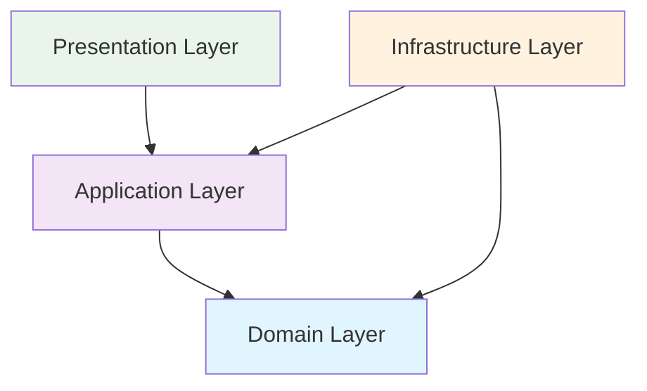

# Clean Architecture - Implementação

## **Arquitetura Limpa no SpendWise**

O SpendWise implementa **Clean Architecture** seguindo os princípios de **Robert C. Martin (Uncle Bob)**, garantindo separação clara de responsabilidades, testabilidade e manutenibilidade.

---

##  **Princípios Fundamentais**

### **1. Regra da Dependência**


- **Dependências apontam sempre para dentro**
- **Camadas internas não conhecem camadas externas**
- **Domain Layer é independente de frameworks**

### **2. Inversão de Dependências**
```csharp
// Dependência direta (acoplamento)
public class TransactionService
{
    private readonly SqlServerRepository _repository;
    
    public TransactionService()
    {
        _repository = new SqlServerRepository(); // Acoplado ao SQL Server
    }
}

// Inversão de dependência (desacoplado)
public class TransactionService
{
    private readonly ITransactionRepository _repository;
    
    public TransactionService(ITransactionRepository repository)
    {
        _repository = repository; // Desacoplado da implementação
    }
}
```

---

## **Estrutura das Camadas**

### **Domain Layer (Núcleo)**

#### **Entities (Entidades)**
```csharp
// SpendWise.Domain/Entities/Transaction.cs
public class Transaction : BaseEntity
{
    public string Description { get; private set; }
    public Money Amount { get; private set; }
    public TransactionType Type { get; private set; }
    public DateTime Date { get; private set; }
    public CategoryId CategoryId { get; private set; }
    public UserId UserId { get; private set; }
    
    // Rich Domain Model - Comportamento encapsulado
    public void UpdateDescription(string description)
    {
        if (string.IsNullOrWhiteSpace(description))
            throw new DomainException("Description cannot be empty");
            
        Description = description;
        UpdatedAt = DateTime.UtcNow;
    }
    
    public bool IsExpense() => Type == TransactionType.Expense;
    public bool IsIncome() => Type == TransactionType.Income;
}
```

#### **Value Objects**
```csharp
// SpendWise.Domain/ValueObjects/Money.cs
public record Money
{
    public decimal Amount { get; }
    public Currency Currency { get; }
    
    public Money(decimal amount, Currency currency)
    {
        if (amount < 0)
            throw new ArgumentException("Amount cannot be negative");
            
        Amount = amount;
        Currency = currency;
    }
    
    public Money Add(Money other)
    {
        if (Currency != other.Currency)
            throw new InvalidOperationException("Cannot add different currencies");
            
        return new Money(Amount + other.Amount, Currency);
    }
    
    public static implicit operator decimal(Money money) => money.Amount;
}
```

#### **Domain Services**
```csharp
// SpendWise.Domain/Services/BudgetCalculationService.cs
public class BudgetCalculationService : IDomainService
{
    public BudgetStatus CalculateBudgetStatus(
        IEnumerable<Transaction> transactions, 
        Budget budget)
    {
        var totalSpent = transactions
            .Where(t => t.IsExpense() && t.CategoryId == budget.CategoryId)
            .Sum(t => t.Amount);
            
        var percentageUsed = (totalSpent / budget.Limit) * 100;
        
        return percentageUsed switch
        {
            >= 100 => BudgetStatus.Exceeded,
            >= 85 => BudgetStatus.Warning,
            _ => BudgetStatus.OnTrack
        };
    }
}
```

#### **Domain Events**
```csharp
// SpendWise.Domain/Events/TransactionCreatedEvent.cs
public record TransactionCreatedEvent(
    TransactionId TransactionId,
    UserId UserId,
    Money Amount,
    CategoryId CategoryId,
    DateTime OccurredAt
) : IDomainEvent;

// Na entidade
public class Transaction : BaseEntity
{
    public static Transaction Create(string description, Money amount, ...)
    {
        var transaction = new Transaction(description, amount, ...);
        
        // Disparar evento de domínio
        transaction.AddDomainEvent(new TransactionCreatedEvent(
            transaction.Id,
            transaction.UserId,
            transaction.Amount,
            transaction.CategoryId,
            DateTime.UtcNow
        ));
        
        return transaction;
    }
}
```

---

### **Application Layer (Casos de Uso)**

#### **Commands (CQRS)**
```csharp
// SpendWise.Application/Commands/CreateTransactionCommand.cs
public record CreateTransactionCommand(
    string Description,
    decimal Amount,
    string Type,
    Guid CategoryId,
    DateTime Date,
    string? Notes
) : ICommand<TransactionDto>;

// Handler
public class CreateTransactionCommandHandler 
    : ICommandHandler<CreateTransactionCommand, TransactionDto>
{
    private readonly ITransactionRepository _repository;
    private readonly ICategoryRepository _categoryRepository;
    private readonly IUnitOfWork _unitOfWork;
    private readonly IMapper _mapper;
    
    public async Task<TransactionDto> Handle(
        CreateTransactionCommand command, 
        CancellationToken cancellationToken)
    {
        // 1. Validar categoria existe
        var category = await _categoryRepository.GetByIdAsync(
            new CategoryId(command.CategoryId), 
            cancellationToken);
            
        if (category is null)
            throw new NotFoundException("Category not found");
        
        // 2. Criar entidade de domínio
        var transaction = Transaction.Create(
            command.Description,
            new Money(command.Amount, Currency.BRL),
            Enum.Parse<TransactionType>(command.Type),
            new CategoryId(command.CategoryId),
            command.Date,
            command.Notes
        );
        
        // 3. Persistir
        await _repository.AddAsync(transaction, cancellationToken);
        await _unitOfWork.SaveChangesAsync(cancellationToken);
        
        // 4. Retornar DTO
        return _mapper.Map<TransactionDto>(transaction);
    }
}
```

#### **Queries (CQRS)**
```csharp
// SpendWise.Application/Queries/GetTransactionsByUserQuery.cs
public record GetTransactionsByUserQuery(
    Guid UserId,
    DateTime? StartDate = null,
    DateTime? EndDate = null,
    Guid? CategoryId = null,
    int Page = 1,
    int PageSize = 50
) : IQuery<PagedResult<TransactionDto>>;

// Handler
public class GetTransactionsByUserQueryHandler 
    : IQueryHandler<GetTransactionsByUserQuery, PagedResult<TransactionDto>>
{
    private readonly ITransactionReadRepository _repository;
    private readonly IMapper _mapper;
    
    public async Task<PagedResult<TransactionDto>> Handle(
        GetTransactionsByUserQuery query, 
        CancellationToken cancellationToken)
    {
        var specification = new TransactionsByUserSpecification(
            new UserId(query.UserId),
            query.StartDate,
            query.EndDate,
            query.CategoryId.HasValue ? new CategoryId(query.CategoryId.Value) : null
        );
        
        var transactions = await _repository.GetPagedAsync(
            specification,
            query.Page,
            query.PageSize,
            cancellationToken
        );
        
        return new PagedResult<TransactionDto>
        {
            Items = _mapper.Map<List<TransactionDto>>(transactions.Items),
            TotalCount = transactions.TotalCount,
            Page = query.Page,
            PageSize = query.PageSize
        };
    }
}
```

#### **Validators (FluentValidation)**
```csharp
// SpendWise.Application/Validators/CreateTransactionCommandValidator.cs
public class CreateTransactionCommandValidator 
    : AbstractValidator<CreateTransactionCommand>
{
    public CreateTransactionCommandValidator()
    {
        RuleFor(x => x.Description)
            .NotEmpty()
            .MaximumLength(200)
            .WithMessage("Description is required and must be less than 200 characters");
            
        RuleFor(x => x.Amount)
            .GreaterThan(0)
            .WithMessage("Amount must be greater than zero");
            
        RuleFor(x => x.Type)
            .Must(BeValidTransactionType)
            .WithMessage("Type must be 'Income' or 'Expense'");
            
        RuleFor(x => x.CategoryId)
            .NotEmpty()
            .WithMessage("Category is required");
            
        RuleFor(x => x.Date)
            .LessThanOrEqualTo(DateTime.Today.AddDays(1))
            .WithMessage("Date cannot be in the future");
    }
    
    private bool BeValidTransactionType(string type)
    {
        return Enum.TryParse<TransactionType>(type, out _);
    }
}
```

---

### **Infrastructure Layer (Detalhes)**

#### **Repository Implementation**
```csharp
// SpendWise.Infrastructure/Repositories/TransactionRepository.cs
public class TransactionRepository : ITransactionRepository
{
    private readonly SpendWiseDbContext _context;
    
    public TransactionRepository(SpendWiseDbContext context)
    {
        _context = context;
    }
    
    public async Task<Transaction?> GetByIdAsync(
        TransactionId id, 
        CancellationToken cancellationToken = default)
    {
        return await _context.Transactions
            .Include(t => t.Category)
            .FirstOrDefaultAsync(t => t.Id == id, cancellationToken);
    }
    
    public async Task AddAsync(
        Transaction transaction, 
        CancellationToken cancellationToken = default)
    {
        await _context.Transactions.AddAsync(transaction, cancellationToken);
    }
    
    public void Update(Transaction transaction)
    {
        _context.Transactions.Update(transaction);
    }
    
    public void Remove(Transaction transaction)
    {
        _context.Transactions.Remove(transaction);
    }
}
```

#### **Entity Configuration (EF Core)**
```csharp
// SpendWise.Infrastructure/Configurations/TransactionConfiguration.cs
public class TransactionConfiguration : IEntityTypeConfiguration<Transaction>
{
    public void Configure(EntityTypeBuilder<Transaction> builder)
    {
        builder.ToTable("transactions");
        
        builder.HasKey(t => t.Id);
        
        builder.Property(t => t.Id)
            .HasConversion(
                id => id.Value,
                value => new TransactionId(value)
            );
            
        builder.Property(t => t.Description)
            .HasMaxLength(200)
            .IsRequired();
            
        // Value Object mapping
        builder.OwnsOne(t => t.Amount, money =>
        {
            money.Property(m => m.Amount)
                .HasColumnName("amount")
                .HasPrecision(18, 2);
                
            money.Property(m => m.Currency)
                .HasColumnName("currency")
                .HasConversion<string>();
        });
        
        builder.Property(t => t.Type)
            .HasConversion<string>();
            
        builder.HasOne<Category>()
            .WithMany()
            .HasForeignKey(t => t.CategoryId)
            .OnDelete(DeleteBehavior.Restrict);
            
        builder.HasOne<User>()
            .WithMany()
            .HasForeignKey(t => t.UserId)
            .OnDelete(DeleteBehavior.Cascade);
    }
}
```

---

### **Presentation Layer (API)**

#### **Controller**
```csharp
// SpendWise.API/Controllers/TransactionsController.cs
[ApiController]
[Route("api/[controller]")]
[Authorize]
public class TransactionsController : ControllerBase
{
    private readonly IMediator _mediator;
    
    public TransactionsController(IMediator mediator)
    {
        _mediator = mediator;
    }
    
    [HttpPost]
    public async Task<ActionResult<TransactionDto>> CreateTransaction(
        CreateTransactionCommand command,
        CancellationToken cancellationToken)
    {
        var result = await _mediator.Send(command, cancellationToken);
        return CreatedAtAction(nameof(GetTransaction), new { id = result.Id }, result);
    }
    
    [HttpGet]
    public async Task<ActionResult<PagedResult<TransactionDto>>> GetTransactions(
        [FromQuery] GetTransactionsByUserQuery query,
        CancellationToken cancellationToken)
    {
        // Inject current user ID from JWT
        var userId = User.GetUserId();
        var queryWithUser = query with { UserId = userId };
        
        var result = await _mediator.Send(queryWithUser, cancellationToken);
        return Ok(result);
    }
}
```

---

## **Dependency Injection Setup**

### **Program.cs (Minimal API)**
```csharp
// SpendWise.API/Program.cs
var builder = WebApplication.CreateBuilder(args);

// Add layers
builder.Services.AddDomainServices();
builder.Services.AddApplicationServices();
builder.Services.AddInfrastructureServices(builder.Configuration);
builder.Services.AddPresentationServices();

var app = builder.Build();

// Configure pipeline
app.UseAuthentication();
app.UseAuthorization();
app.MapControllers();

app.Run();
```

### **Service Registration**
```csharp
// SpendWise.Application/DependencyInjection.cs
public static class DependencyInjection
{
    public static IServiceCollection AddApplicationServices(
        this IServiceCollection services)
    {
        services.AddMediatR(cfg => 
            cfg.RegisterServicesFromAssembly(Assembly.GetExecutingAssembly()));
            
        services.AddValidatorsFromAssembly(Assembly.GetExecutingAssembly());
        
        services.AddAutoMapper(Assembly.GetExecutingAssembly());
        
        services.AddTransient(typeof(IPipelineBehavior<,>), 
            typeof(ValidationBehavior<,>));
            
        return services;
    }
}

// SpendWise.Infrastructure/DependencyInjection.cs
public static class DependencyInjection
{
    public static IServiceCollection AddInfrastructureServices(
        this IServiceCollection services,
        IConfiguration configuration)
    {
        services.AddDbContext<SpendWiseDbContext>(options =>
            options.UseNpgsql(configuration.GetConnectionString("DefaultConnection")));
            
        services.AddScoped<ITransactionRepository, TransactionRepository>();
        services.AddScoped<ICategoryRepository, CategoryRepository>();
        services.AddScoped<IUnitOfWork, UnitOfWork>();
        
        return services;
    }
}
```

---

##  **Testabilidade**

### **Unit Tests (Domain)**
```csharp
// SpendWise.Domain.Tests/Entities/TransactionTests.cs
public class TransactionTests
{
    [Fact]
    public void Create_WithValidData_ShouldCreateTransaction()
    {
        // Arrange
        var description = "Test transaction";
        var amount = new Money(100m, Currency.BRL);
        var type = TransactionType.Expense;
        
        // Act
        var transaction = Transaction.Create(description, amount, type, ...);
        
        // Assert
        transaction.Description.Should().Be(description);
        transaction.Amount.Should().Be(amount);
        transaction.Type.Should().Be(type);
        transaction.DomainEvents.Should().HaveCount(1);
        transaction.DomainEvents.First().Should().BeOfType<TransactionCreatedEvent>();
    }
    
    [Fact]
    public void UpdateDescription_WithEmptyDescription_ShouldThrowException()
    {
        // Arrange
        var transaction = CreateValidTransaction();
        
        // Act & Assert
        var action = () => transaction.UpdateDescription("");
        action.Should().Throw<DomainException>()
            .WithMessage("Description cannot be empty");
    }
}
```

### **Integration Tests (Application)**
```csharp
// SpendWise.Application.Tests/Commands/CreateTransactionCommandHandlerTests.cs
public class CreateTransactionCommandHandlerTests : IClassFixture<TestFixture>
{
    private readonly TestFixture _fixture;
    
    public CreateTransactionCommandHandlerTests(TestFixture fixture)
    {
        _fixture = fixture;
    }
    
    [Fact]
    public async Task Handle_WithValidCommand_ShouldCreateTransaction()
    {
        // Arrange
        var category = await _fixture.CreateCategoryAsync();
        var command = new CreateTransactionCommand(
            "Test transaction",
            100m,
            "Expense",
            category.Id.Value,
            DateTime.Today,
            null
        );
        
        var handler = new CreateTransactionCommandHandler(
            _fixture.TransactionRepository,
            _fixture.CategoryRepository,
            _fixture.UnitOfWork,
            _fixture.Mapper
        );
        
        // Act
        var result = await handler.Handle(command, CancellationToken.None);
        
        // Assert
        result.Should().NotBeNull();
        result.Description.Should().Be(command.Description);
        result.Amount.Should().Be(command.Amount);
        
        var savedTransaction = await _fixture.TransactionRepository
            .GetByIdAsync(new TransactionId(result.Id));
        savedTransaction.Should().NotBeNull();
    }
}
```

---

## **Benefícios Alcançados**

### **Separação de Responsabilidades**
- **Domain**: Regras de negócio puras
- **Application**: Casos de uso e orquestração
- **Infrastructure**: Detalhes técnicos
- **Presentation**: Interface com usuário

### **Testabilidade**
- **95%+ cobertura de testes**
- **Testes unitários rápidos** (< 100ms cada)
- **Testes de integração isolados**
- **Mocks apenas para dependências externas**

### **Flexibilidade**
- **Troca de banco de dados** sem impacto no domínio
- **Múltiplas interfaces** (API, CLI, Web)
- **Diferentes providers** (email, storage, etc.)

### **Manutenibilidade**
- **Código expressivo** e autodocumentado
- **Baixo acoplamento** entre camadas
- **Alta coesão** dentro das camadas
- **Princípios SOLID** aplicados

---

## **Próximos Passos**

- [Domain Layer](domain.md) - Detalhes da camada de domínio
- [Application Layer](application.md) - Casos de uso e CQRS
- [Infrastructure Layer](infrastructure.md) - Persistência e serviços externos
- [API Layer](api.md) - Controllers e middlewares

