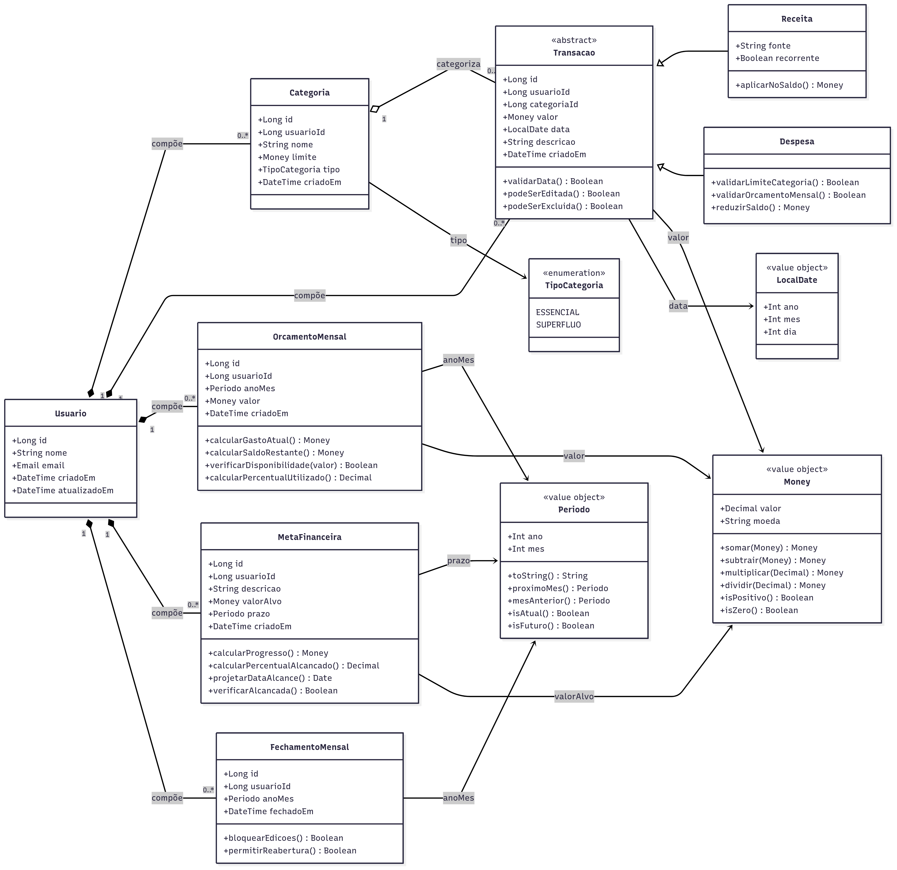

# Diagrama de Classes - SpendWise

## **Arquitetura de Classes**

O SpendWise implementa **Clean Architecture** com **Domain-Driven Design (DDD)**, seguindo os princípios **SOLID** e padrões modernos de desenvolvimento.

---

## **Diagrama de Classes Completo**

### **Visão Geral da Arquitetura**



O diagrama acima mostra a estrutura completa das classes do sistema, organizadas por camadas da **Clean Architecture**.

---

## **Camadas da Arquitetura**

### **1. Domain Layer (Núcleo)**

#### **Entities (Entidades)**
```csharp
// Entidade base com eventos de domínio
public abstract class BaseEntity
{
    public Guid Id { get; protected set; }
    public DateTime CreatedAt { get; protected set; }
    public DateTime UpdatedAt { get; protected set; }
    
    private readonly List<IDomainEvent> _domainEvents = new();
    public IReadOnlyCollection<IDomainEvent> DomainEvents => _domainEvents.AsReadOnly();
    
    protected void AddDomainEvent(IDomainEvent domainEvent)
    {
        _domainEvents.Add(domainEvent);
    }
    
    public void ClearDomainEvents()
    {
        _domainEvents.Clear();
    }
}

// Entidade User
public class User : BaseEntity
{
    public string Name { get; private set; }
    public Email Email { get; private set; }
    public string PasswordHash { get; private set; }
    public bool IsActive { get; private set; }
    
    private User() { } // EF Core
    
    public User(string name, Email email, string passwordHash)
    {
        Id = Guid.NewGuid();
        Name = name ?? throw new ArgumentNullException(nameof(name));
        Email = email ?? throw new ArgumentNullException(nameof(email));
        PasswordHash = passwordHash ?? throw new ArgumentNullException(nameof(passwordHash));
        IsActive = true;
        CreatedAt = DateTime.UtcNow;
        UpdatedAt = DateTime.UtcNow;
        
        AddDomainEvent(new UserCreatedEvent(Id, Email.Value));
    }
    
    public void UpdateName(string name)
    {
        if (string.IsNullOrWhiteSpace(name))
            throw new DomainException("Name cannot be empty");
            
        Name = name;
        UpdatedAt = DateTime.UtcNow;
    }
    
    public void Deactivate()
    {
        IsActive = false;
        UpdatedAt = DateTime.UtcNow;
        AddDomainEvent(new UserDeactivatedEvent(Id));
    }
}

// Entidade Transaction
public class Transaction : BaseEntity
{
    public string Description { get; private set; }
    public Money Amount { get; private set; }
    public TransactionType Type { get; private set; }
    public DateTime Date { get; private set; }
    public string? Notes { get; private set; }
    public List<string> Tags { get; private set; }
    
    // Relacionamentos
    public UserId UserId { get; private set; }
    public CategoryId? CategoryId { get; private set; } // Null para receitas
    
    private Transaction() { } // EF Core
    
    public static Transaction CreateExpense(
        string description,
        Money amount,
        DateTime date,
        UserId userId,
        CategoryId categoryId,
        string? notes = null)
    {
        ValidateCommonFields(description, amount, date);
        
        if (categoryId == null)
            throw new DomainException("Expense must have a category");
            
        var transaction = new Transaction
        {
            Id = Guid.NewGuid(),
            Description = description,
            Amount = amount,
            Type = TransactionType.Expense,
            Date = date,
            UserId = userId,
            CategoryId = categoryId,
            Notes = notes,
            Tags = new List<string>(),
            CreatedAt = DateTime.UtcNow,
            UpdatedAt = DateTime.UtcNow
        };
        
        transaction.AddDomainEvent(new TransactionCreatedEvent(
            transaction.Id, userId, amount, TransactionType.Expense));
            
        return transaction;
    }
    
    public static Transaction CreateIncome(
        string description,
        Money amount,
        DateTime date,
        UserId userId,
        string? notes = null)
    {
        ValidateCommonFields(description, amount, date);
        
        var transaction = new Transaction
        {
            Id = Guid.NewGuid(),
            Description = description,
            Amount = amount,
            Type = TransactionType.Income,
            Date = date,
            UserId = userId,
            CategoryId = null, // Receitas não têm categoria
            Notes = notes,
            Tags = new List<string>(),
            CreatedAt = DateTime.UtcNow,
            UpdatedAt = DateTime.UtcNow
        };
        
        transaction.AddDomainEvent(new TransactionCreatedEvent(
            transaction.Id, userId, amount, TransactionType.Income));
            
        return transaction;
    }
    
    private static void ValidateCommonFields(string description, Money amount, DateTime date)
    {
        if (string.IsNullOrWhiteSpace(description))
            throw new DomainException("Description cannot be empty");
            
        if (amount.Amount <= 0)
            throw new DomainException("Amount must be greater than zero");
            
        if (date > DateTime.Today)
            throw new DomainException("Date cannot be in the future");
    }
    
    public void UpdateDescription(string description)
    {
        if (string.IsNullOrWhiteSpace(description))
            throw new DomainException("Description cannot be empty");
            
        Description = description;
        UpdatedAt = DateTime.UtcNow;
    }
    
    public bool IsExpense() => Type == TransactionType.Expense;
    public bool IsIncome() => Type == TransactionType.Income;
}

// Entidade Category
public class Category : BaseEntity
{
    public string Name { get; private set; }
    public string? Description { get; private set; }
    public string Color { get; private set; }
    public string Icon { get; private set; }
    public CategoryType Type { get; private set; }
    public Money? MonthlyLimit { get; private set; }
    public bool IsActive { get; private set; }
    
    // Relacionamentos
    public UserId UserId { get; private set; }
    
    private Category() { } // EF Core
    
    public Category(
        string name,
        UserId userId,
        CategoryType type,
        string color = "#10b981",
        string icon = "folder",
        string? description = null,
        Money? monthlyLimit = null)
    {
        Id = Guid.NewGuid();
        Name = name ?? throw new ArgumentNullException(nameof(name));
        UserId = userId ?? throw new ArgumentNullException(nameof(userId));
        Type = type;
        Color = color;
        Icon = icon;
        Description = description;
        MonthlyLimit = monthlyLimit;
        IsActive = true;
        CreatedAt = DateTime.UtcNow;
        UpdatedAt = DateTime.UtcNow;
        
        AddDomainEvent(new CategoryCreatedEvent(Id, userId, name));
    }
    
    public void UpdateLimit(Money? limit)
    {
        if (limit?.Amount < 0)
            throw new DomainException("Limit cannot be negative");
            
        MonthlyLimit = limit;
        UpdatedAt = DateTime.UtcNow;
    }
    
    public void Deactivate()
    {
        IsActive = false;
        UpdatedAt = DateTime.UtcNow;
    }
}
```

#### **Value Objects**
```csharp
// Value Object Money
public record Money
{
    public decimal Amount { get; }
    public Currency Currency { get; }
    
    public Money(decimal amount, Currency currency = Currency.BRL)
    {
        if (amount < 0)
            throw new ArgumentException("Amount cannot be negative", nameof(amount));
            
        Amount = Math.Round(amount, 2);
        Currency = currency;
    }
    
    public Money Add(Money other)
    {
        if (Currency != other.Currency)
            throw new InvalidOperationException("Cannot add different currencies");
            
        return new Money(Amount + other.Amount, Currency);
    }
    
    public Money Subtract(Money other)
    {
        if (Currency != other.Currency)
            throw new InvalidOperationException("Cannot subtract different currencies");
            
        return new Money(Amount - other.Amount, Currency);
    }
    
    public static implicit operator decimal(Money money) => money.Amount;
    
    public override string ToString() => $"{Amount:C}";
}

// Value Object Email
public record Email
{
    public string Value { get; }
    
    public Email(string value)
    {
        if (string.IsNullOrWhiteSpace(value))
            throw new ArgumentException("Email cannot be empty", nameof(value));
            
        if (!IsValidEmail(value))
            throw new ArgumentException("Invalid email format", nameof(value));
            
        Value = value.ToLowerInvariant();
    }
    
    private static bool IsValidEmail(string email)
    {
        try
        {
            var addr = new System.Net.Mail.MailAddress(email);
            return addr.Address == email;
        }
        catch
        {
            return false;
        }
    }
    
    public static implicit operator string(Email email) => email.Value;
    public static implicit operator Email(string email) => new(email);
}

// Strongly Typed IDs
public record UserId(Guid Value)
{
    public static implicit operator Guid(UserId id) => id.Value;
    public static implicit operator UserId(Guid id) => new(id);
}

public record CategoryId(Guid Value)
{
    public static implicit operator Guid(CategoryId id) => id.Value;
    public static implicit operator CategoryId(Guid id) => new(id);
}

public record TransactionId(Guid Value)
{
    public static implicit operator Guid(TransactionId id) => id.Value;
    public static implicit operator TransactionId(Guid id) => new(id);
}
```

#### **Domain Events**
```csharp
public interface IDomainEvent
{
    Guid Id { get; }
    DateTime OccurredAt { get; }
}

public record UserCreatedEvent(UserId UserId, string Email) : IDomainEvent
{
    public Guid Id { get; } = Guid.NewGuid();
    public DateTime OccurredAt { get; } = DateTime.UtcNow;
}

public record TransactionCreatedEvent(
    TransactionId TransactionId,
    UserId UserId,
    Money Amount,
    TransactionType Type
) : IDomainEvent
{
    public Guid Id { get; } = Guid.NewGuid();
    public DateTime OccurredAt { get; } = DateTime.UtcNow;
}

public record CategoryCreatedEvent(
    CategoryId CategoryId,
    UserId UserId,
    string Name
) : IDomainEvent
{
    public Guid Id { get; } = Guid.NewGuid();
    public DateTime OccurredAt { get; } = DateTime.UtcNow;
}
```

#### **Domain Services**
```csharp
public interface IBudgetCalculationService
{
    Task<BudgetStatus> CalculateBudgetStatusAsync(
        CategoryId categoryId, 
        DateTime month, 
        CancellationToken cancellationToken = default);
}

public class BudgetCalculationService : IBudgetCalculationService
{
    private readonly ITransactionRepository _transactionRepository;
    private readonly ICategoryRepository _categoryRepository;
    
    public BudgetCalculationService(
        ITransactionRepository transactionRepository,
        ICategoryRepository categoryRepository)
    {
        _transactionRepository = transactionRepository;
        _categoryRepository = categoryRepository;
    }
    
    public async Task<BudgetStatus> CalculateBudgetStatusAsync(
        CategoryId categoryId, 
        DateTime month, 
        CancellationToken cancellationToken = default)
    {
        var category = await _categoryRepository.GetByIdAsync(categoryId, cancellationToken);
        if (category?.MonthlyLimit == null)
            return BudgetStatus.NoLimit;
            
        var transactions = await _transactionRepository.GetByCategoryAndMonthAsync(
            categoryId, month, cancellationToken);
            
        var totalSpent = transactions
            .Where(t => t.IsExpense())
            .Sum(t => t.Amount.Amount);
            
        var percentageUsed = (totalSpent / category.MonthlyLimit.Amount) * 100;
        
        return percentageUsed switch
        {
            >= 100 => BudgetStatus.Exceeded,
            >= 85 => BudgetStatus.Warning,
            _ => BudgetStatus.OnTrack
        };
    }
}
```

---

### **2. Application Layer (Casos de Uso)**

#### **Commands e Handlers (CQRS)**
```csharp
// Command
public record CreateTransactionCommand(
    string Description,
    decimal Amount,
    string Type,
    Guid? CategoryId,
    DateTime Date,
    string? Notes
) : ICommand<TransactionDto>;

// Handler
public class CreateTransactionCommandHandler 
    : ICommandHandler<CreateTransactionCommand, TransactionDto>
{
    private readonly ITransactionRepository _transactionRepository;
    private readonly ICategoryRepository _categoryRepository;
    private readonly IUnitOfWork _unitOfWork;
    private readonly IMapper _mapper;
    private readonly ICurrentUserService _currentUserService;
    
    public CreateTransactionCommandHandler(
        ITransactionRepository transactionRepository,
        ICategoryRepository categoryRepository,
        IUnitOfWork unitOfWork,
        IMapper mapper,
        ICurrentUserService currentUserService)
    {
        _transactionRepository = transactionRepository;
        _categoryRepository = categoryRepository;
        _unitOfWork = unitOfWork;
        _mapper = mapper;
        _currentUserService = currentUserService;
    }
    
    public async Task<TransactionDto> Handle(
        CreateTransactionCommand command, 
        CancellationToken cancellationToken)
    {
        var userId = _currentUserService.GetUserId();
        var transactionType = Enum.Parse<TransactionType>(command.Type);
        var amount = new Money(command.Amount);
        
        Transaction transaction;
        
        if (transactionType == TransactionType.Expense)
        {
            if (!command.CategoryId.HasValue)
                throw new ValidationException("Category is required for expenses");
                
            var category = await _categoryRepository.GetByIdAsync(
                new CategoryId(command.CategoryId.Value), cancellationToken);
                
            if (category == null)
                throw new NotFoundException("Category not found");
                
            transaction = Transaction.CreateExpense(
                command.Description,
                amount,
                command.Date,
                userId,
                new CategoryId(command.CategoryId.Value),
                command.Notes
            );
        }
        else
        {
            transaction = Transaction.CreateIncome(
                command.Description,
                amount,
                command.Date,
                userId,
                command.Notes
            );
        }
        
        await _transactionRepository.AddAsync(transaction, cancellationToken);
        await _unitOfWork.SaveChangesAsync(cancellationToken);
        
        return _mapper.Map<TransactionDto>(transaction);
    }
}
```

#### **Queries e Handlers**
```csharp
// Query
public record GetTransactionsByUserQuery(
    int Page = 1,
    int PageSize = 50,
    string? Type = null,
    Guid? CategoryId = null,
    DateTime? StartDate = null,
    DateTime? EndDate = null
) : IQuery<PagedResult<TransactionDto>>;

// Handler
public class GetTransactionsByUserQueryHandler 
    : IQueryHandler<GetTransactionsByUserQuery, PagedResult<TransactionDto>>
{
    private readonly ITransactionReadRepository _repository;
    private readonly IMapper _mapper;
    private readonly ICurrentUserService _currentUserService;
    
    public async Task<PagedResult<TransactionDto>> Handle(
        GetTransactionsByUserQuery query, 
        CancellationToken cancellationToken)
    {
        var userId = _currentUserService.GetUserId();
        
        var specification = new TransactionsByUserSpecification(
            userId,
            query.Type,
            query.CategoryId,
            query.StartDate,
            query.EndDate
        );
        
        var transactions = await _repository.GetPagedAsync(
            specification,
            query.Page,
            query.PageSize,
            cancellationToken
        );
        
        return new PagedResult<TransactionDto>
        {
            Items = _mapper.Map<List<TransactionDto>>(transactions.Items),
            TotalCount = transactions.TotalCount,
            Page = query.Page,
            PageSize = query.PageSize,
            TotalPages = (int)Math.Ceiling((double)transactions.TotalCount / query.PageSize)
        };
    }
}
```

#### **DTOs**
```csharp
public record TransactionDto
{
    public Guid Id { get; init; }
    public string Description { get; init; } = string.Empty;
    public decimal Amount { get; init; }
    public string Type { get; init; } = string.Empty;
    public DateTime Date { get; init; }
    public string? Notes { get; init; }
    public List<string> Tags { get; init; } = new();
    public CategoryDto? Category { get; init; }
    public DateTime CreatedAt { get; init; }
    public DateTime UpdatedAt { get; init; }
}

public record CategoryDto
{
    public Guid Id { get; init; }
    public string Name { get; init; } = string.Empty;
    public string? Description { get; init; }
    public string Color { get; init; } = string.Empty;
    public string Icon { get; init; } = string.Empty;
    public string Type { get; init; } = string.Empty;
    public decimal? MonthlyLimit { get; init; }
    public bool IsActive { get; init; }
}
```

---

### **3. Infrastructure Layer (Detalhes)**

#### **Repository Implementations**
```csharp
public class TransactionRepository : ITransactionRepository
{
    private readonly SpendWiseDbContext _context;
    
    public TransactionRepository(SpendWiseDbContext context)
    {
        _context = context;
    }
    
    public async Task<Transaction?> GetByIdAsync(
        TransactionId id, 
        CancellationToken cancellationToken = default)
    {
        return await _context.Transactions
            .Include(t => t.Category)
            .FirstOrDefaultAsync(t => t.Id == id.Value, cancellationToken);
    }
    
    public async Task<List<Transaction>> GetByCategoryAndMonthAsync(
        CategoryId categoryId, 
        DateTime month, 
        CancellationToken cancellationToken = default)
    {
        var startOfMonth = new DateTime(month.Year, month.Month, 1);
        var endOfMonth = startOfMonth.AddMonths(1).AddDays(-1);
        
        return await _context.Transactions
            .Where(t => t.CategoryId == categoryId.Value)
            .Where(t => t.Date >= startOfMonth && t.Date <= endOfMonth)
            .ToListAsync(cancellationToken);
    }
    
    public async Task AddAsync(
        Transaction transaction, 
        CancellationToken cancellationToken = default)
    {
        await _context.Transactions.AddAsync(transaction, cancellationToken);
    }
    
    public void Update(Transaction transaction)
    {
        _context.Transactions.Update(transaction);
    }
    
    public void Remove(Transaction transaction)
    {
        _context.Transactions.Remove(transaction);
    }
}
```

#### **DbContext**
```csharp
public class SpendWiseDbContext : DbContext
{
    public DbSet<User> Users { get; set; } = null!;
    public DbSet<Category> Categories { get; set; } = null!;
    public DbSet<Transaction> Transactions { get; set; } = null!;
    
    public SpendWiseDbContext(DbContextOptions<SpendWiseDbContext> options) 
        : base(options) { }
    
    protected override void OnModelCreating(ModelBuilder modelBuilder)
    {
        modelBuilder.ApplyConfigurationsFromAssembly(Assembly.GetExecutingAssembly());
        base.OnModelCreating(modelBuilder);
    }
    
    public override async Task<int> SaveChangesAsync(CancellationToken cancellationToken = default)
    {
        var domainEvents = ChangeTracker
            .Entries<BaseEntity>()
            .Where(x => x.Entity.DomainEvents.Any())
            .SelectMany(x => x.Entity.DomainEvents)
            .ToList();
            
        var result = await base.SaveChangesAsync(cancellationToken);
        
        // Publish domain events
        foreach (var domainEvent in domainEvents)
        {
            await _mediator.Publish(domainEvent, cancellationToken);
        }
        
        return result;
    }
}
```

---

### **4. Presentation Layer (API)**

#### **Controllers**
```csharp
[ApiController]
[Route("api/[controller]")]
[Authorize]
public class TransactionsController : ControllerBase
{
    private readonly IMediator _mediator;
    
    public TransactionsController(IMediator mediator)
    {
        _mediator = mediator;
    }
    
    [HttpGet]
    public async Task<ActionResult<PagedResult<TransactionDto>>> GetTransactions(
        [FromQuery] GetTransactionsByUserQuery query,
        CancellationToken cancellationToken)
    {
        var result = await _mediator.Send(query, cancellationToken);
        return Ok(result);
    }
    
    [HttpPost]
    public async Task<ActionResult<TransactionDto>> CreateTransaction(
        CreateTransactionCommand command,
        CancellationToken cancellationToken)
    {
        var result = await _mediator.Send(command, cancellationToken);
        return CreatedAtAction(nameof(GetTransaction), new { id = result.Id }, result);
    }
    
    [HttpGet("{id:guid}")]
    public async Task<ActionResult<TransactionDto>> GetTransaction(
        Guid id,
        CancellationToken cancellationToken)
    {
        var query = new GetTransactionByIdQuery(id);
        var result = await _mediator.Send(query, cancellationToken);
        return Ok(result);
    }
}
```

---

## **Padrões Implementados**

### **Design Patterns**
- **Repository Pattern**: Abstração do acesso a dados
- **Unit of Work**: Controle transacional
- **Mediator Pattern**: Desacoplamento entre camadas
- **Factory Pattern**: Criação de entidades complexas
- **Specification Pattern**: Consultas reutilizáveis
- **Domain Events**: Comunicação entre agregados

### **Princípios SOLID**
- **S**ingle Responsibility: Cada classe tem uma responsabilidade
- **O**pen/Closed: Extensível sem modificação
- **L**iskov Substitution: Subtipos substituíveis
- **I**nterface Segregation: Interfaces específicas
- **D**ependency Inversion: Dependa de abstrações

### **DDD Patterns**
- **Entities**: Identidade única e ciclo de vida
- **Value Objects**: Imutáveis e sem identidade
- **Aggregates**: Consistência transacional
- **Domain Services**: Lógica que não pertence a entidades
- **Domain Events**: Comunicação entre contextos

---

## **Métricas de Qualidade**

### **Complexidade Ciclomática**
- **Domain Layer**: < 5 (baixa complexidade)
- **Application Layer**: < 10 (complexidade moderada)
- **Infrastructure Layer**: < 15 (complexidade aceitável)

### **Cobertura de Testes**
- **Domain Layer**: 100% (crítico)
- **Application Layer**: 95%+ (muito importante)
- **Infrastructure Layer**: 80%+ (importante)

### **Acoplamento**
- **Afferent Coupling (Ca)**: Baixo
- **Efferent Coupling (Ce)**: Controlado
- **Instability (I)**: Estável no domínio

---

## **Benefícios da Arquitetura**

### **Testabilidade**
- **Isolamento**: Cada camada pode ser testada independentemente
- **Mocks**: Apenas para dependências externas
- **Velocidade**: Testes unitários rápidos (< 100ms)

### **Manutenibilidade**
- **Separação**: Responsabilidades bem definidas
- **Extensibilidade**: Fácil adição de novas funcionalidades
- **Refatoração**: Mudanças localizadas

### **Performance**
- **CQRS**: Otimização separada para leitura e escrita
- **Lazy Loading**: Carregamento sob demanda
- **Caching**: Estratégias por camada

### **Escalabilidade**
- **Horizontal**: Múltiplas instâncias
- **Vertical**: Otimização por camada
- **Microservices**: Preparado para decomposição

---

*O diagrama de classes reflete uma arquitetura robusta, testável e manutenível, seguindo as melhores práticas de **Clean Architecture** e **Domain-Driven Design**.*

