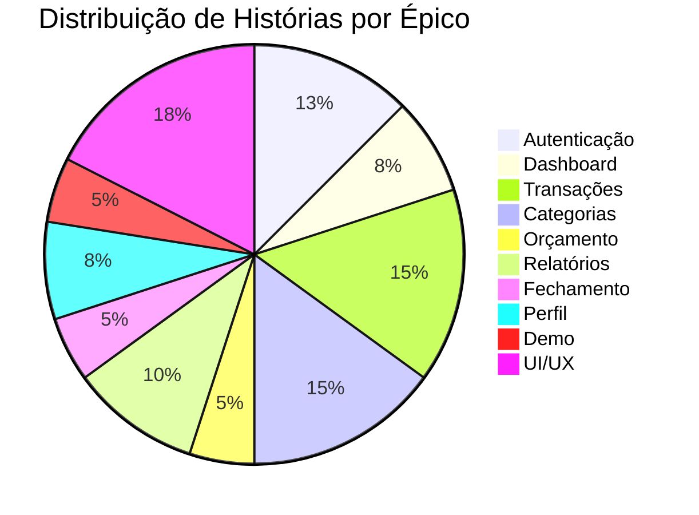

# Product Backlog - Frontend

!!! info "Informação"
    Este documento apresenta o **Product Backlog completo** do frontend SpendWise, organizado em épicos e histórias de usuário seguindo metodologias ágeis.

## 📊 Resumo Executivo

| Métrica | Valor | Status |
|---------|-------|--------|
| **Épicos** | 10 | :material-check-all: 100% |
| **Histórias de Usuário** | 40 | :material-check-all: 100% |
| **Tarefas Técnicas** | 7 | :material-check-all: 100% |
| **Páginas Implementadas** | 15 | :material-check-all: 100% |
| **Componentes React** | 50+ | :material-check-all: 100% |
| **Hooks Customizados** | 8 | :material-check-all: 100% |

---

## :material-shield-account: Épico 1: Autenticação e Segurança

### US-001: Cadastro de Novo Usuário

!!! success "Status: Concluído"

**Como** um novo usuário  
**Quero** me cadastrar no sistema  
**Para** poder gerenciar minhas finanças pessoais

**Critérios de Aceitação:**

- [x] Formulário com campos: Nome, Email, Senha, Confirmar Senha
- [x] Validação de email único
- [x] Validação de senha (mínimo 6 caracteres)
- [x] Confirmação de senha deve ser igual à senha
- [x] Feedback visual de sucesso/erro
- [x] Redirecionamento automático para dashboard após cadastro
- [x] Inputs arredondados (`rounded-xl`)

**Arquivos:**

- `app/(auth)/register/page.tsx`
- `lib/api/client.ts` (método `register`)

---

### US-002: Login de Usuário

!!! success "Status: Concluído"

**Como** um usuário cadastrado  
**Quero** fazer login no sistema  
**Para** acessar minha conta e dados financeiros

**Critérios de Aceitação:**

- [x] Formulário com campos: Email e Senha
- [x] Validação de credenciais
- [x] Armazenamento seguro do token JWT no localStorage
- [x] Redirecionamento para dashboard após login
- [x] Link para "Esqueci minha senha"
- [x] Inputs arredondados, botão Google removido

**Arquivos:**

- `app/(auth)/login/page.tsx`
- `lib/contexts/AuthContext.tsx`

---

### US-003: Recuperação de Senha

!!! success "Status: Concluído"

**Como** um usuário que esqueceu sua senha  
**Quero** solicitar a redefinição da senha  
**Para** recuperar o acesso à minha conta

**Critérios de Aceitação:**

- [x] Tela "Esqueci Senha" com campo de email
- [x] Envio de email com token de recuperação
- [x] Token válido por 30 minutos
- [x] Feedback visual após envio

**Arquivos:**

- `app/(auth)/esqueci-senha/page.tsx`

---

### US-004: Redefinir Senha

!!! success "Status: Concluído"

**Como** um usuário com token de recuperação  
**Quero** redefinir minha senha  
**Para** voltar a acessar minha conta

**Critérios de Aceitação:**

- [x] Tela com campos: Nova Senha e Confirmar Senha
- [x] Validação de token (via query params)
- [x] Validação de senha (mínimo 6 caracteres)
- [x] Redirecionamento para login após sucesso

**Arquivos:**

- `app/(auth)/redefinir-senha/page.tsx`

---

### US-005: Proteção de Rotas

!!! success "Status: Concluído"

**Como** desenvolvedor  
**Quero** proteger rotas autenticadas  
**Para** garantir segurança do sistema

**Critérios de Aceitação:**

- [x] Middleware que verifica autenticação
- [x] Redirecionamento para login se não autenticado
- [x] Persistência de sessão (token no localStorage)
- [x] Logout limpa token e redireciona

**Arquivos:**

- `middleware.ts`
- `components/auth/protected-route.tsx`

---

## :material-view-dashboard: Épico 2: Dashboard e Visão Geral

### US-006: Visualizar Dashboard Principal

!!! success "Status: Concluído"

**Como** um usuário autenticado  
**Quero** ver um resumo das minhas finanças  
**Para** ter uma visão geral rápida

**Critérios de Aceitação:**

- [x] KPIs: Receitas, Despesas, Saldo, % Orçamento
- [x] Gráfico de evolução diária
- [x] Gráfico de pizza por categoria
- [x] Lista de transações recentes (últimas 5)
- [x] Alertas de categorias próximas/acima do limite
- [x] Seletor de mês para filtrar dados
- [x] Design profissional com tema slate/emerald
- [x] Responsivo (mobile-first)

**Arquivos:**

- `app/(app)/dashboard/page.tsx`
- `components/charts/daily-evolution-chart.tsx`
- `components/charts/category-donut-chart.tsx`

---

### US-007: Filtrar Dashboard por Mês

!!! success "Status: Concluído"

**Como** um usuário  
**Quero** filtrar o dashboard por mês  
**Para** analisar períodos específicos

**Critérios de Aceitação:**

- [x] Dropdown com últimos 6 meses
- [x] Atualização automática de KPIs ao mudar mês
- [x] Atualização de gráficos ao mudar mês
- [x] Mês atual selecionado por padrão
- [x] Formato: "Mês/Ano" (ex: "Out/2025")

**Arquivos:**

- `components/month-selector.tsx`

---

### US-008: Notificações Automáticas de Limite

!!! success "Status: Concluído"

**Como** um usuário  
**Quero** receber notificações quando atingir limites  
**Para** controlar meus gastos proativamente

**Critérios de Aceitação:**

- [x] Notificação quando atingir 80% do limite
- [x] Notificação quando atingir 100% do limite
- [x] Notificação quando exceder o limite
- [x] Notificações aparecem automaticamente no dashboard
- [x] Ícone de sino com badge de contagem
- [x] Painel de notificações expansível

**Arquivos:**

- `hooks/use-auto-notifications.ts`
- `components/notifications-dropdown.tsx`

---

## :material-swap-horizontal: Épico 3: Gestão de Transações

### US-009: Listar Transações

!!! success "Status: Concluído"

**Como** um usuário  
**Quero** visualizar todas as minhas transações  
**Para** acompanhar meu histórico financeiro

**Critérios de Aceitação:**

- [x] Lista com todas as transações
- [x] Informações: Descrição, Valor, Tipo, Categoria, Data
- [x] Cores diferentes para receita (verde) e despesa (vermelho)
- [x] Badge colorido com nome da categoria
- [x] Loading state durante carregamento

**Arquivos:**

- `app/(app)/transacoes/page.tsx`
- `hooks/use-transacoes.ts`

---

### US-010: Criar Nova Transação

!!! success "Status: Concluído"

**Como** um usuário  
**Quero** registrar uma nova transação  
**Para** manter meu histórico atualizado

**Critérios de Aceitação:**

- [x] Modal com formulário
- [x] Campos: Descrição, Valor, Tipo, Categoria, Data, Observações
- [x] Validação de campos obrigatórios
- [x] Validação de limite de categoria (despesas)
- [x] Aviso se atingir limite exato
- [x] Bloqueio se exceder limite
- [x] Atualização automática da lista após criação

**Arquivos:**

- `components/nova-transacao-modal.tsx`

---

### US-011: Editar Transação

!!! success "Status: Concluído"

**Como** um usuário  
**Quero** editar uma transação existente  
**Para** corrigir informações incorretas

**Critérios de Aceitação:**

- [x] Botão de editar em cada transação
- [x] Modal pré-preenchido com dados atuais
- [x] Mesmas validações da criação
- [x] Atualização automática da lista após edição

---

### US-012: Excluir Transação

!!! success "Status: Concluído"

**Como** um usuário  
**Quero** excluir uma transação  
**Para** remover registros incorretos

**Critérios de Aceitação:**

- [x] Botão de excluir em cada transação
- [x] Modal de confirmação antes de excluir
- [x] Mensagem clara sobre ação irreversível
- [x] Atualização automática da lista após exclusão

**Arquivos:**

- `components/confirm-delete-transacao-modal.tsx`

---

### US-013: Filtrar Transações

!!! success "Status: Concluído"

**Como** um usuário  
**Quero** filtrar transações por tipo, categoria e período  
**Para** encontrar transações específicas

**Critérios de Aceitação:**

- [x] Filtro por tipo (Todos, Receita, Despesa)
- [x] Filtro por categoria (dropdown com todas)
- [x] Filtro por período (últimos 6 meses)
- [x] Busca por descrição (campo de texto)
- [x] Aplicação de múltiplos filtros simultaneamente

---

### US-014: KPIs de Transações

!!! success "Status: Concluído"

**Como** um usuário  
**Quero** ver KPIs das transações filtradas  
**Para** ter insights rápidos

**Critérios de Aceitação:**

- [x] Total de Receitas do período
- [x] Total de Despesas do período
- [x] Saldo do período
- [x] Quantidade total de transações
- [x] Atualização automática ao filtrar

---

## :material-tag-multiple: Épico 4: Gestão de Categorias

### US-015: Listar Categorias

!!! success "Status: Concluído"

**Como** um usuário  
**Quero** visualizar todas as minhas categorias  
**Para** gerenciar minha organização financeira

**Critérios de Aceitação:**

- [x] Grid de cards com todas as categorias
- [x] Informações: Nome, Cor, Gasto, Limite, Tipo
- [x] Barra de progresso visual do gasto vs limite
- [x] Cores indicativas (verde, amarelo, vermelho)
- [x] Ícone representativo por categoria

**Arquivos:**

- `app/(app)/categorias/page.tsx`
- `hooks/use-categorias.ts`

---

### US-016: Criar Nova Categoria

!!! success "Status: Concluído"

**Como** um usuário  
**Quero** criar uma nova categoria  
**Para** organizar melhor minhas transações

**Critérios de Aceitação:**

- [x] Modal com formulário
- [x] Campos: Nome, Cor (seletor), Limite, Tipo, Prioridade
- [x] Validação de nome único
- [x] Paleta de cores pré-definida
- [x] Atualização automática da lista após criação

**Arquivos:**

- `components/nova-categoria-modal.tsx`

---

### US-017: Editar Categoria

!!! success "Status: Concluído"

**Como** um usuário  
**Quero** editar uma categoria existente  
**Para** ajustar limites e configurações

---

### US-018: Excluir Categoria

!!! success "Status: Concluído"

**Como** um usuário  
**Quero** excluir uma categoria  
**Para** remover categorias não utilizadas

**Arquivos:**

- `components/confirm-delete-modal.tsx`

---

### US-019: KPIs de Categorias

!!! success "Status: Concluído"

**Como** um usuário  
**Quero** ver totais consolidados das categorias  
**Para** entender minha distribuição de gastos

**Critérios de Aceitação:**

- [x] Total Orçado (soma de todos os limites)
- [x] Total Gasto (soma de todas as despesas)
- [x] Total Disponível (orçado - gasto)

---

### US-020: Validação de Limite de Categoria

!!! success "Status: Concluído"
!!! warning "Regra de Negócio Crítica"

**Como** um usuário  
**Quero** ser avisado quando atingir o limite de uma categoria  
**Para** controlar meus gastos

**Critérios de Aceitação:**

- [x] Permite gastar ATÉ o limite (inclusive)
- [x] Bloqueia se exceder o limite
- [x] Avisa com confirmação se atingir limite exato
- [x] Toast vermelho se tentar exceder
- [x] Detalhes do cálculo no aviso

---

## :material-chart-box: Épico 5: Orçamento Mensal

### US-021: Visualizar Orçamento do Mês

!!! success "Status: Concluído"

**Como** um usuário  
**Quero** ver o orçamento do mês atual  
**Para** acompanhar minha execução orçamentária

**Arquivos:**

- `app/(app)/orcamento/page.tsx`
- `hooks/use-orcamento.ts`

---

### US-022: Estatísticas de Orçamento

!!! success "Status: Concluído"

**Como** um usuário  
**Quero** ver estatísticas detalhadas do orçamento  
**Para** analisar minha performance financeira

**Arquivos:**

- `components/budget/budget-overview.tsx`
- `components/budget/weekly-spending-chart.tsx`

---

## :material-file-chart: Épico 6: Relatórios

### US-023: Relatório por Categoria

!!! success "Status: Concluído"

**Arquivos:**

- `components/reports/reports-by-category.tsx`

---

### US-024: Relatório Mensal

!!! success "Status: Concluído"

**Arquivos:**

- `components/reports/reports-by-month.tsx`

---

### US-025: Comparação Anual

!!! success "Status: Concluído"

**Arquivos:**

- `components/charts/yearly-comparison-chart.tsx`

---

### US-026: Exportar Relatório PDF

!!! success "Status: Concluído"

**Biblioteca:** `jspdf` + `jspdf-autotable`

---

## :material-lock-check: Épico 7: Fechamento Mensal

### US-027: Fechar Mês

!!! success "Status: Concluído"

**Arquivos:**

- `app/(app)/fechamento/page.tsx`
- `components/closure/monthly-closure-card.tsx`

---

### US-028: Histórico de Fechamentos

!!! success "Status: Concluído"

**Arquivos:**

- `components/closure/closure-history.tsx`

---

## :material-account: Épico 8: Perfil e Configurações

### US-029: Visualizar Perfil

!!! success "Status: Concluído"

---

### US-030: Editar Perfil

!!! success "Status: Concluído"

---

### US-031: Configurações do Sistema

!!! success "Status: Concluído"

**Arquivos:**

- `app/(app)/configuracoes/page.tsx`
- `components/theme-toggle.tsx`

---

## :material-eye: Épico 9: Página de Demonstração

### US-032: Landing Page

!!! success "Status: Concluído"

**Arquivos:**

- `app/page.tsx`

---

### US-033: Modo Demonstração

!!! success "Status: Concluído"

**Arquivos:**

- `app/demo/*`
- `components/demo-banner.tsx`

---

## :material-palette: Épico 10: UI/UX e Componentes

### US-034: Sistema de Design

!!! success "Status: Concluído"

**Arquivos:**

- `tailwind.config.js`
- `components/ui/*` (40+ componentes)

---

### US-035: Componentes de Gráficos

!!! success "Status: Concluído"

**Biblioteca:** `recharts`

---

### US-036: Navegação e Layout

!!! success "Status: Concluído"

---

### US-037: Feedback Visual

!!! success "Status: Concluído"

**Biblioteca:** `sonner`

---

### US-038: Responsividade

!!! success "Status: Concluído"

---

### US-039: Tema Claro/Escuro

!!! success "Status: Concluído"

**Biblioteca:** `next-themes`

---

### US-040: Acessibilidade

!!! success "Status: Concluído"

---

## :material-tools: Tarefas Técnicas

### TT-001: Setup Projeto

!!! success "Concluído"
    Next.js + TypeScript + Tailwind CSS + shadcn/ui

---

### TT-002: Cliente API

!!! success "Concluído"
    ApiClient centralizado com autenticação JWT

**Arquivos:** `lib/api/client.ts`

---

### TT-003: Context API

!!! success "Concluído"
    AuthContext com persistência de token

**Arquivos:** `lib/contexts/AuthContext.tsx`

---

### TT-004: Hooks Customizados

!!! success "Concluído"
    8 hooks criados para reutilização de lógica

**Arquivos:** `hooks/*`

---

### TT-005: Testes E2E

!!! success "Concluído"
    Playwright configurado com CI/CD

**Arquivos:** `e2e/*`, `playwright.config.ts`

---

### TT-006: Docker

!!! success "Concluído"
    Dockerfile otimizado com multi-stage build

**Arquivos:** `Dockerfile`, `docker-compose.yml`

---

### TT-007: CI/CD

!!! success "Concluído"
    GitHub Actions com 8 jobs configurados

**Arquivos:** `.github/workflows/ci-cd.yml`

---

## 📊 Estatísticas Finais



---

## 📁 Estrutura de Arquivos

```
frontend/
├── app/
│   ├── (app)/              # 8 páginas autenticadas
│   ├── (auth)/             # 4 páginas de autenticação
│   ├── demo/               # 7 páginas de demonstração
│   └── page.tsx            # Landing page
├── components/
│   ├── ui/                 # 40+ componentes (shadcn/ui)
│   ├── charts/             # 5 gráficos (recharts)
│   └── [outros]/           # Componentes específicos
├── hooks/                  # 8 hooks customizados
├── lib/
│   ├── api/                # Cliente API
│   ├── contexts/           # Context API
│   └── utils/              # Utilitários
└── e2e/                    # Testes E2E (Playwright)
```

---

## 🎯 Valor Entregue

### Para o Usuário:
- ✅ Sistema completo de gestão financeira
- ✅ Interface moderna e intuitiva
- ✅ Controle total de receitas e despesas
- ✅ Alertas e notificações inteligentes
- ✅ Relatórios e análises detalhadas
- ✅ Modo demo para experimentar

### Para o Desenvolvedor:
- ✅ Código TypeScript 100% tipado
- ✅ Componentes reutilizáveis
- ✅ Testes automatizados
- ✅ CI/CD configurado
- ✅ Docker pronto para produção
- ✅ Documentação completa
