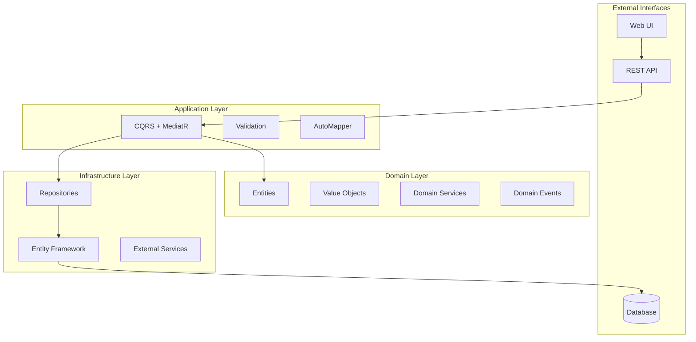
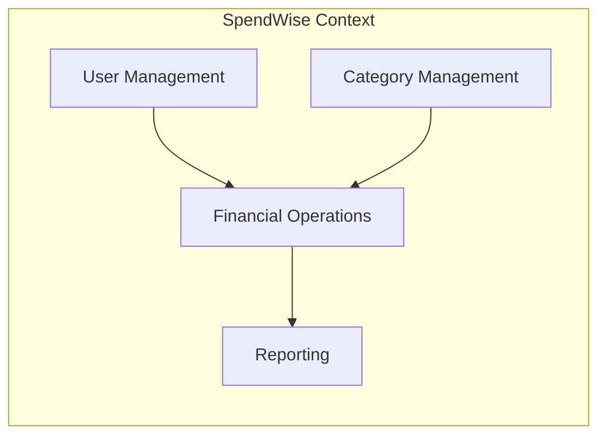
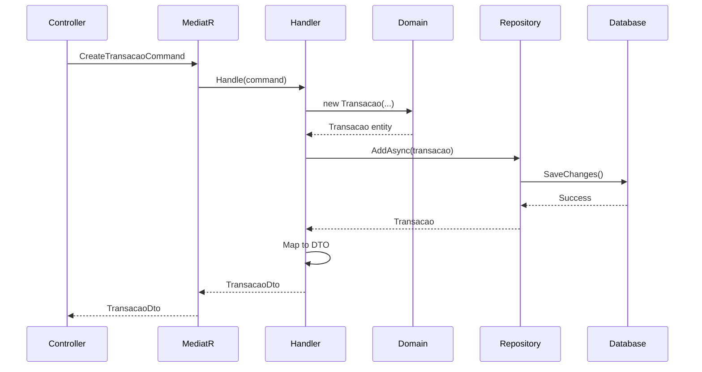
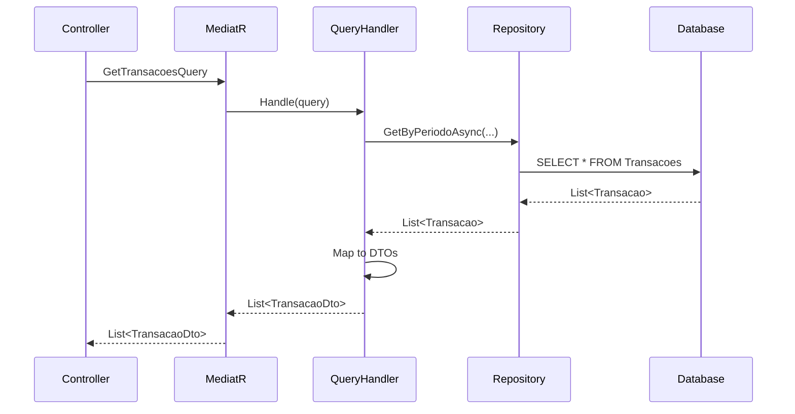

# Arquitetura do Sistema

## **Visão Geral da Arquitetura**

O SpendWise implementa uma arquitetura moderna baseada em **Clean Architecture**, **Domain-Driven Design (DDD)** e **CQRS**, garantindo separação clara de responsabilidades e alta testabilidade.

##  **Clean Architecture**

### **Camadas da Arquitetura**



### **Princípios Aplicados**

#### **1. Dependency Inversion**
- Camadas internas não dependem de camadas externas
- Dependências apontam para dentro
- Abstrações não dependem de detalhes

#### **2. Separation of Concerns**
- Cada camada tem responsabilidade específica
- Domain contém apenas regras de negócio
- Infrastructure isola detalhes técnicos

#### **3. Testability**
- Domain é facilmente testável
- Dependências são injetadas
- Mocks podem ser facilmente criados

## **Domain-Driven Design (DDD)**

### **Bounded Contexts**



### **Domain Model**

#### **Entities**
- **Usuario**: Agregado raiz para gestão de usuários
- **Transacao**: Entidade central para movimentações financeiras
- **Categoria**: Classificação de transações
- **OrcamentoMensal**: Controle de limites mensais
- **Meta**: Objetivos financeiros

#### **Value Objects**
- **Money**: Representação segura de valores monetários
- **Email**: Validação e normalização de emails
- **Periodo**: Encapsulamento de períodos temporais

#### **Aggregates**
- **Usuario Aggregate**: Gerencia dados do usuário e suas transações
- **Categoria Aggregate**: Controla categorias e seus limites

### **Domain Services**
- **TransacaoService**: Lógica complexa de transações
- **OrcamentoService**: Cálculos de orçamento
- **RelatorioService**: Geração de relatórios

## **CQRS (Command Query Responsibility Segregation)**

### **Commands (Escrita)**
```csharp
public record CreateTransacaoCommand(
    string Descricao,
    decimal Valor,
    DateTime DataTransacao,
    TipoTransacao Tipo,
    Guid UsuarioId,
    Guid CategoriaId
) : IRequest<TransacaoDto>;
```

### **Queries (Leitura)**
```csharp
public record GetTransacoesByPeriodoQuery(
    DateTime DataInicio,
    DateTime DataFim,
    Guid UsuarioId
) : IRequest<IEnumerable<TransacaoDto>>;
```

### **Handlers**
```csharp
public class CreateTransacaoCommandHandler : IRequestHandler<CreateTransacaoCommand, TransacaoDto>
{
    private readonly IUnitOfWork _unitOfWork;
    private readonly IMapper _mapper;

    public async Task<TransacaoDto> Handle(CreateTransacaoCommand request, CancellationToken cancellationToken)
    {
        // Lógica de criação
    }
}
```

## **Estrutura de Camadas**

### **Domain Layer**
```
SpendWise.Domain/
 Entities/           # Entidades de negócio
 ValueObjects/       # Objetos de valor
 Interfaces/         # Contratos do domínio
 Enums/             # Enumerações
 Exceptions/        # Exceções de domínio
 Utils/             # Utilitários
```

### **Application Layer**
```
SpendWise.Application/
 Commands/          # Comandos CQRS
 Queries/           # Consultas CQRS
 Handlers/          # Handlers CQRS
 DTOs/              # Data Transfer Objects
 Validators/        # Validações
 Services/          # Serviços de aplicação
 Mappings/          # Mapeamentos AutoMapper
```

### **Infrastructure Layer**
```
SpendWise.Infrastructure/
 Data/              # Entity Framework
 Repositories/      # Implementações de repositórios
 Services/          # Serviços externos
 Configurations/    # Configurações EF
 Migrations/        # Migrações do banco
```

### **API Layer**
```
SpendWise.API/
 Controllers/       # Controllers REST
 Middleware/        # Middleware customizado
 Extensions/        # Extensões
 Program.cs         # Configuração da aplicação
```

## **Fluxo de Dados**

### **Criação de Transação**



### **Consulta de Transações**



##  **Testabilidade**

### **Estratégia de Testes**

#### **Unit Tests (Domain)**
- Testam regras de negócio isoladamente
- Sem dependências externas
- Foco em lógica de domínio

#### **Integration Tests (Application)**
- Testam handlers CQRS
- Com dependências mockadas
- Validação de fluxos completos

#### **API Tests (Infrastructure)**
- Testam endpoints completos
- Com banco de dados real
- Validação end-to-end

### **Mocking Strategy**
```csharp
// Exemplo de teste com mock
[Fact]
public async Task CreateTransacao_ShouldReturnSuccess()
{
    // Arrange
    var mockUnitOfWork = new Mock<IUnitOfWork>();
    var mockMapper = new Mock<IMapper>();
    var handler = new CreateTransacaoCommandHandler(mockUnitOfWork.Object, mockMapper.Object);
    
    // Act
    var result = await handler.Handle(command, CancellationToken.None);
    
    // Assert
    Assert.NotNull(result);
    mockUnitOfWork.Verify(x => x.SaveChangesAsync(), Times.Once);
}
```

## **Segurança**

### **Autenticação e Autorização**
- **JWT Tokens** para autenticação
- **Claims-based** authorization
- **Middleware** de autenticação
- **Proteção** de rotas sensíveis

### **Validação de Dados**
- **FluentValidation** para validações
- **Model Validation** no ASP.NET Core
- **Sanitização** de inputs
- **Rate Limiting** para APIs

## **Performance**

### **Otimizações Implementadas**
- **Async/Await** em todas as operações I/O
- **Pagination** para listagens grandes
- **Caching** de consultas frequentes
- **Connection Pooling** no banco de dados

### **Monitoring**
- **Health Checks** para monitoramento
- **Structured Logging** com Serilog
- **Metrics** de performance
- **Error Tracking** centralizado

## **Escalabilidade**

### **Horizontal Scaling**
- **Stateless** design
- **Database** independente
- **Load Balancing** ready
- **Microservices** preparation

### **Vertical Scaling**
- **Memory** optimization
- **CPU** efficient algorithms
- **Database** indexing
- **Caching** strategies

## **Manutenibilidade**

### **Code Quality**
- **SOLID** principles
- **Clean Code** practices
- **Design Patterns** aplicados
- **Documentation** completa

### **Refactoring**
- **Small** methods
- **Single** responsibility
- **Testable** code
- **Readable** structure

Esta arquitetura garante que o sistema seja **robusto**, **escalável**, **testável** e **maintível**, seguindo as melhores práticas da indústria de software.


